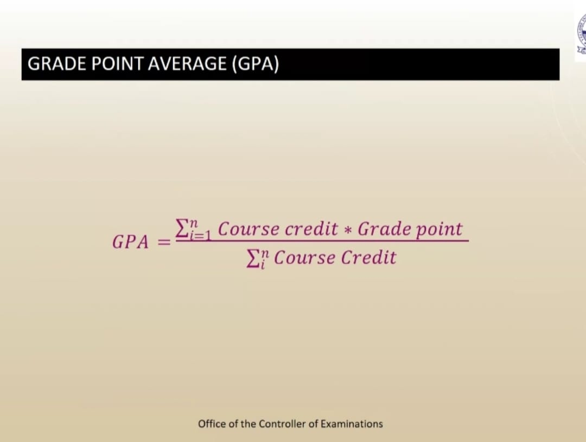
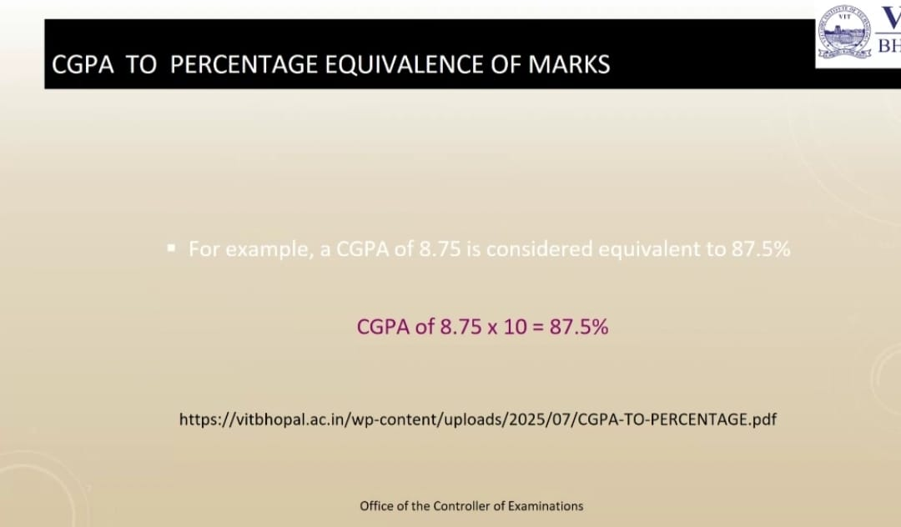
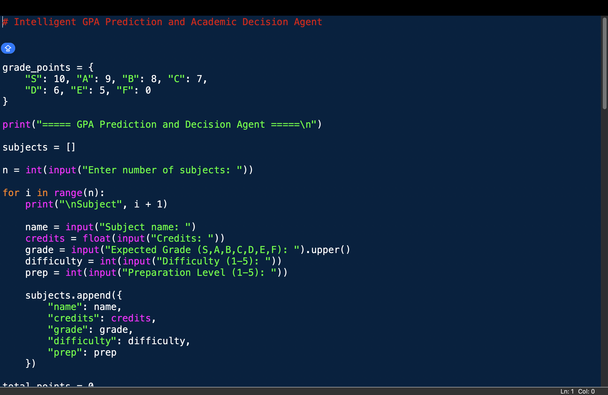
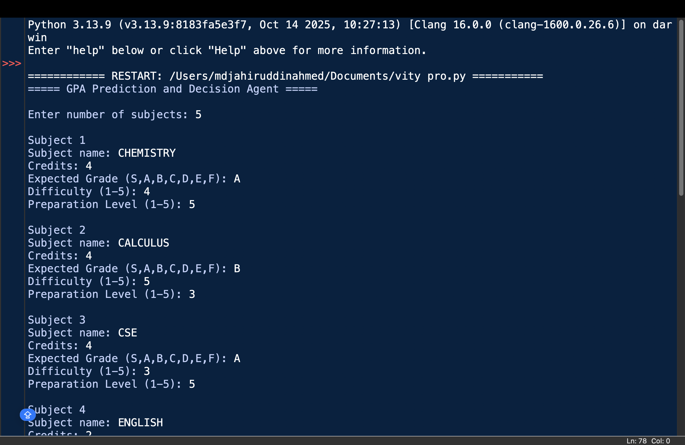
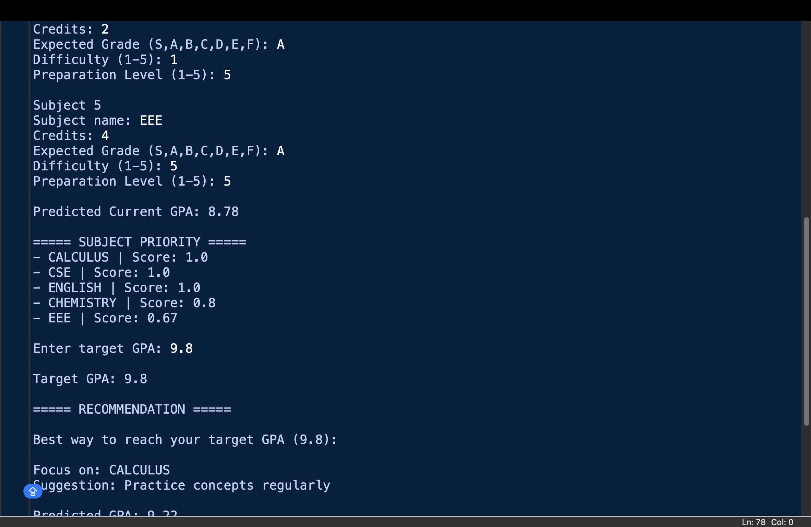
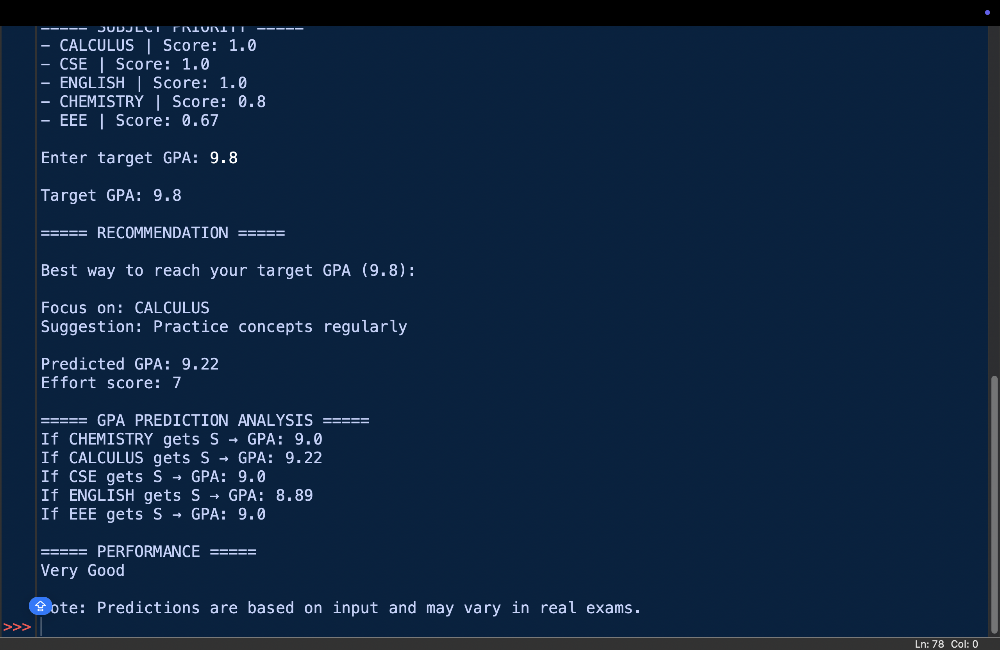

# Intelligent GPA Prediction and Academic Decision Support System

A structured, AI-inspired system that predicts GPA based on expected grades and helps students make smarter academic decisions.

The system predicts GPA based on the expected grades entered by the user. It analyzes each subject using credits, difficulty, and preparation level. A score is calculated to identify which subjects have the highest impact. Based on this, it suggests where to focus for better academic performance.

---

## 1. Overview

This project helps students estimate their GPA using expected (predicted) grades and plan their study strategy effectively.

Instead of studying all subjects randomly, the system identifies which subjects will give maximum improvement with minimum effort.

It is designed based on the VIT Bhopal GPA system, making it practical for real academic use.

---

## 2. Problem Statement

Students often struggle with:

- Which subject should I focus on?  
- How can I improve my GPA efficiently?  
- What will my GPA be based on my preparation?  

This project provides a structured and logical solution to these problems.

---

## 3. Objectives

- Predict GPA based on expected grades  
- Identify high-impact subjects  
- Suggest best subject to improve  
- Help achieve a target GPA  
- Provide a structured study strategy  

---

## 4. GPA System (VIT Bhopal)

The GPA is calculated using a weighted average method:

### Grade Points

- S = 10  
- A = 9  
- B = 8  
- C = 7  
- D = 6  
- E = 5  
- F = 0  

### GPA Formula

---

## 5. Methodology

1. Take subject details as input  
2. Calculate predicted GPA  
3. Compute subject priority (impact vs effort)  
4. Suggest best subject to improve  
5. Perform GPA prediction analysis  

---

## 6. Subject Priority Score

Each subject is assigned a score based on its impact on GPA and the effort required to improve it.

A higher score means the subject can improve GPA more efficiently with less effort.

---

## 7. Algorithm

1. Input number of subjects  
2. Store subject details  
3. Calculate GPA using:

   GPA = Σ(grade_points × credits) / Σ(credits)

   

4. For each subject:
   - Impact = credits × (10 − grade point)  
   - Effort = difficulty + (5 − preparation)  
   - Score = impact / (effort + 1)  

5. Sort subjects based on score  
6. Simulate improvement  
7. Select best subject  
8. Display results  

---

## 8. Features

- GPA prediction based on expected grades  
- Subject prioritization  
- Target GPA planning  
- What-if GPA analysis  
- Study suggestions  
- Command-line based system  

---

## 9. Screenshots

### Program

### Output

---

## 10. Setup and Installation

- Install Python (version 3.x)
- No external libraries required (uses only built-in Python)

---

## 11. How to Run (Command Line)

1. Clone the repository:
git clone https://github.com/jahiruddincse/Intelligent-GPA-Prediction-and-Academic-Decision-Support-System

2. Go inside the folder:
cd Intelligent-GPA-Prediction-and-Academic-Decision-Support-System

3. Run the program:
gpa_decision_agent.py

## 12. How to Use

1. Enter number of subjects  
2. Enter subject details (credits, grade, difficulty, preparation)  
3. Enter target GPA  
4. You will see GPA, priority, and recommendation

## 13. Limitations

- The system is rule-based and not a trained machine learning model  
- Results depend on the accuracy of user input  
- It assumes improvement to grade “S” for prediction  
- Does not consider real exam uncertainty or external factors 

## 14. Conclusion

This project presents a simple and practical approach to academic planning using basic AI-inspired logic. By predicting GPA based on expected grades and analyzing subject priority through an impact vs effort model, it helps students make better study decisions.

The system is easy to use, requires no external libraries, and runs completely through the command line. It demonstrates how fundamental programming and analytical thinking can be applied to solve real-world student problems effectively.

Overall, the project provides a useful tool for improving academic performance while also reflecting the core concepts learned in the course.

